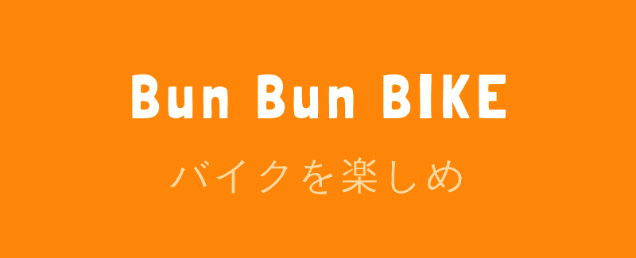

<h1 align="center">BunBunBIKE</h1>

## URL

[アプリ](https://bunbunbike.app/login) 
[使い方](https://nagisa-profile.com/works/bike-custom-diary)

## 使用した技術

| 領域             | 技術やツール            |
| ---------------- | ----------------------- |
| フロントエンド   | React/TypeScript/       |
| バックエンド     | Firebase                |
| 状態管理         | Redux                   |
| スタイル         | Tailwind                |
| Hosting          | Vercel                  |
| 認証             | Firebase Authentication |
| ストレージ       | Firebase Storage        |
| Linter/Formatter | ESLint/Prettier         |

### その他ライブラリ等

- date-fns(日付データのフォーマット)
- react-hot-toast(トースト表示)
- react-loading-skeleton(スケルトンローディング)
- react-slick(スライドショー)

## 実装に詰まったところ

- 全ページフルレスポンシブ対応
- TypeScript を React で使う際の型定義
- ファイル構成
- グローバルなステート管理とローカルなステート管理
- 非同期処理
- firestore からのデータ取得

## 改善点

- テストを書く
- 再レンダリングの抑制(useMemo,React.memo,useCallback 等)

## これから実装したい機能

- 検索機能
- 投稿の削除機能
